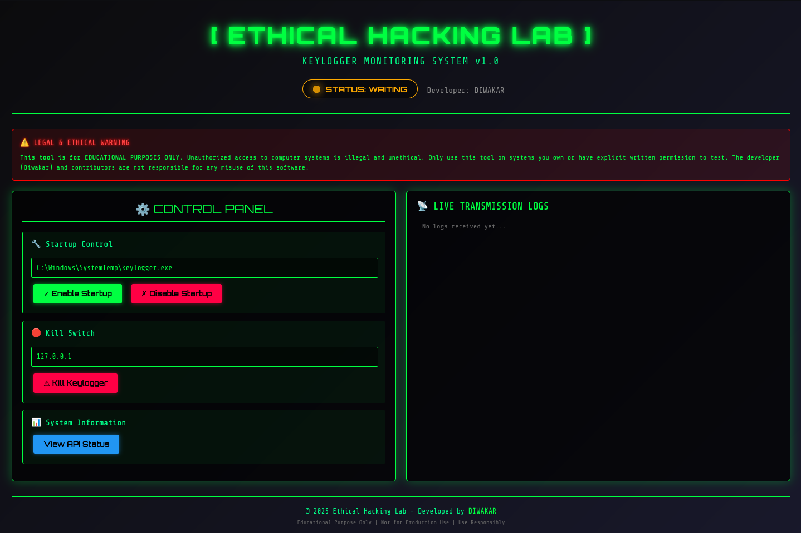

# Keylogger with Encrypted Data Exfiltration

## ⚠️ Legal & Ethical Warning

**This tool is for EDUCATIONAL PURPOSES ONLY.** Unauthorized access to computer systems is illegal and unethical. Only use this tool on systems you own or have explicit written permission to test. The developer and contributors are not responsible for any misuse of this software.

## Introduction

This project is a sophisticated keylogging tool developed for educational purposes within an ethical hacking lab environment. It consists of two main components:

*   **`enhanced_keylogger.py`**: A stealthy, persistent keylogger that captures keystrokes, encrypts the data, and sends it to a remote server.
*   **`enhanced_server.py`**: A Flask-based web server with an integrated control panel to receive, decrypt, and display the logged keystrokes in real-time.

## Features
 
### Keylogger (`enhanced_keylogger.py`)

*   **Stealth Operations**: Copies itself to a hidden system directory (`C:\Windows\SystemTemp`) and runs in the background without a console window.
*   **Persistence**: Adds itself to the Windows startup registry to ensure it runs automatically on system boot.
*   **Data Encryption**: All captured keystrokes are encrypted using the Fernet (AES128-CBC) symmetric encryption scheme before being sent to the server.
*   **Secure Key Management**: Generates a unique encryption key on first run, saves it to a hidden file, and transmits it securely to the server. It also copies the key to any connected removable drives (e.g., USB sticks) for easy retrieval.
*   **Adaptive C&C Communication**:
    *   Sends logged data to the server at regular intervals.
    *   Implements an adaptive retry mechanism: if the server is unreachable, it increases the time between connection attempts to reduce network noise and avoid detection.
*   **Remote Kill Switch**: The keylogger can be remotely terminated by the server creating a specific signal file on the target machine.
*   **Emergency Stop**: Pressing and holding the `ESC` key for 10 seconds will terminate the keylogger script.

### Server (`enhanced_server.py`)

*   **Web-Based Control Panel**: A modern, responsive web interface for monitoring and controlling the keylogger.
*   **Real-time Log Display**: View decrypted keystrokes as they are received in a live-updating log panel.
*   **Keylogger Status**: The dashboard displays the keylogger's status (Online, Offline, or Waiting) based on the last received communication.
*   **Remote Control**:
    *   **Enable/Disable Startup**: Remotely enable or disable the keylogger's persistence mechanism.
    *   **Kill Switch**: Send a remote command to terminate the keylogger on the target machine.
*   **Secure Key Reception**: A dedicated endpoint to securely receive and save the encryption key from the keylogger.
*   **Automatic Log Organization**: Encrypted and decrypted logs are automatically saved into separate, date-stamped files for easy analysis.
*   **Automatic Browser Launch**: The server automatically opens the control panel in a web browser upon startup for immediate access.

## Requirements

### Keylogger (`enhanced_keylogger.py`)

*   **Operating System**: Windows
*   **Python**: 3.x
*   **Python Libraries**:
    *   `pynput`: For capturing keyboard input.
    *   `requests`: For sending HTTP requests to the server.
    *   `cryptography`: For data encryption.

### Server (`enhanced_server.py`)

*   **Operating System**: Windows, macOS, or Linux
*   **Python**: 3.x
*   **Python Libraries**:
    *   `flask`: To run the web server and control panel.
    *   `cryptography`: For data decryption.

## Installation and Setup

### 1. Server Setup

1.  **Clone the repository or download the files.**
   ```bash
    git clone https://github.com/djodiwa/Cyber-Security-Internship/tree/main/PROJECT
   ```

3.  **Open a terminal or command prompt and navigate to the project directory.**

4.  **Install the required Python libraries:**
    ```bash
    pip install flask cryptography
    ```

5.  **Run the server script:**
    ```bash
    python enhanced_server.py
    ```

6.  The server will start, and the control panel will automatically open in your default web browser at `http://localhost:8080`.



### 2. Keylogger Configuration and Deployment

1.  **Open the `enhanced_keylogger.py` script in a text editor.**

2.  **Configure the server's IP address and port number.** Find the following lines and replace the placeholder IP address with the IP address of the machine running the server.

    ```python
    # Hard code the values of your server and ip address here.
    ip_address = "YOUR_SERVER_IP_ADDRESS"  # e.g., "192.168.1.10"
    port_number = "8080"
    ```
    *   If you are testing on the same machine, you can use `"127.0.0.1"`.
    *   If the server is on another computer on the same network, use its local IP address.

3.  **Run the `enhanced_keylogger.py` script on the target Windows machine.**
    *   You can run it directly using Python: `python enhanced_keylogger.py`
    *   For a more realistic scenario, you can compile it into a `.exe` file using a tool like PyInstaller.

## How It Works

1.  **Initial Execution**: When the keylogger is first run on the target machine, it copies itself to a hidden directory (`C:\Windows\SystemTemp`) and executes the new copy.
2.  **Persistence**: The new script instance adds itself to the Windows startup registry to ensure it runs every time the system boots.
3.  **Key Generation**: It generates a unique encryption key and saves it in a hidden file within its directory.
4.  **Key Transmission**: The keylogger sends this encryption key to the server's `/send_key` endpoint. The server saves the key to be used for decrypting future messages.
5.  **Key Backup**: The keylogger also saves a copy of the key to any connected removable drives.
6.  **Keystroke Logging**: The keylogger captures all keystrokes and stores them in memory.
7.  **Data Transmission**: Periodically, the keylogger encrypts the captured keystrokes and sends them to the server's main endpoint (`/`).
8.  **Server-Side Processing**: The server receives the encrypted data, decrypts it using the stored key, and displays the plaintext in the web control panel. Both encrypted and decrypted logs are saved to files.

## Usage

Once the server is running and the keylogger is deployed:

1.  **Open the Web Control Panel**: Access `http://<your_server_ip>:8080` in a web browser.
2.  **Monitor Keystrokes**: The "Live Transmission Logs" panel will automatically update with new keystrokes as they are received.
3.  **Control the Keylogger**: Use the "Control Panel" to remotely manage the keylogger's startup behavior or to terminate it using the kill switch.

## DETAILED REPORT
📄 [Download Full Project Report (PDF)](../assets/PROJECT-REPORT.pdf)

## Disclaimer

This project is intended for educational and research purposes only. The user is responsible for complying with all applicable laws and regulations. The creators of this project do not condone any illegal or malicious use of this software.
