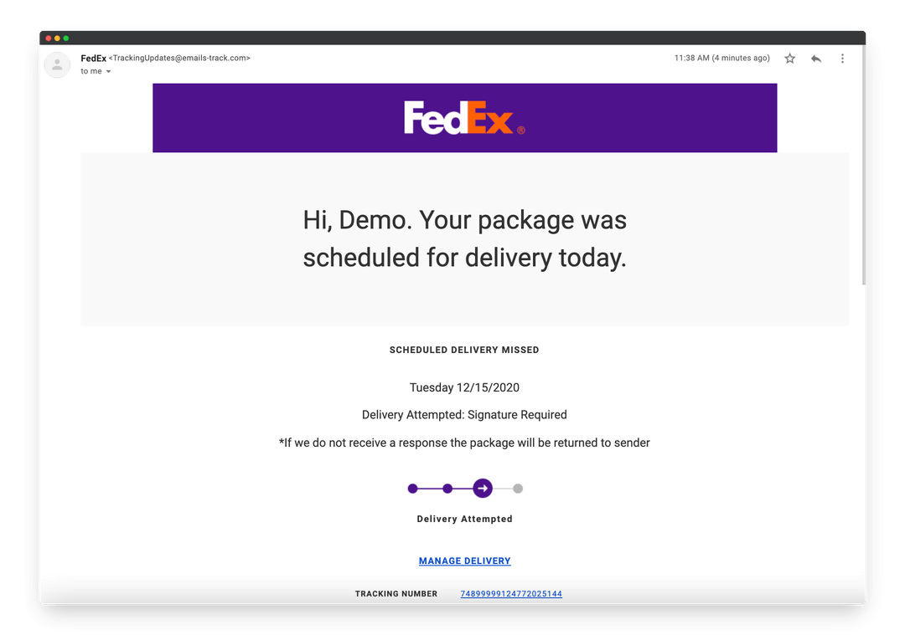
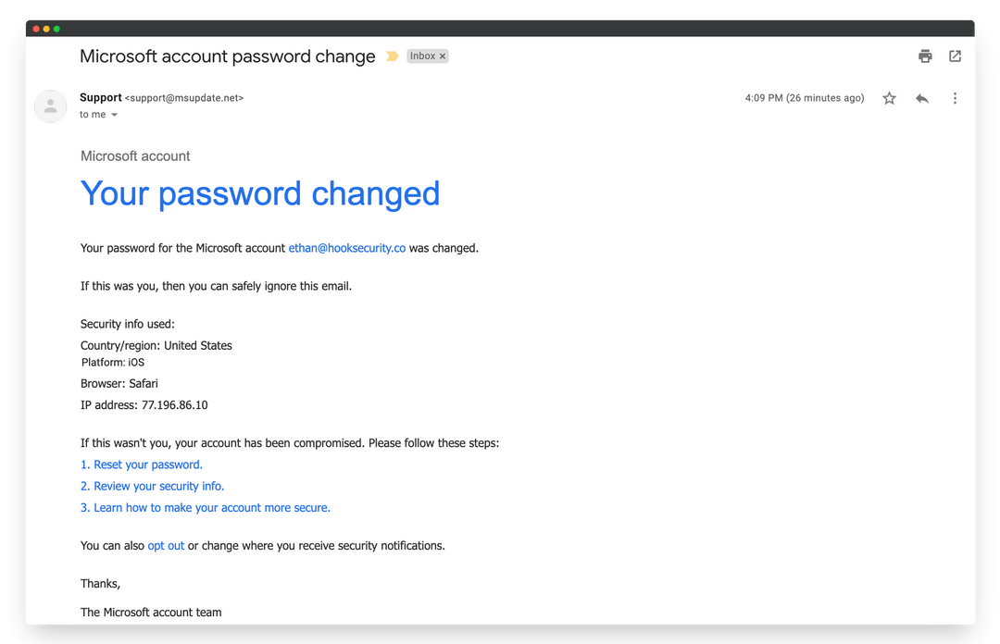
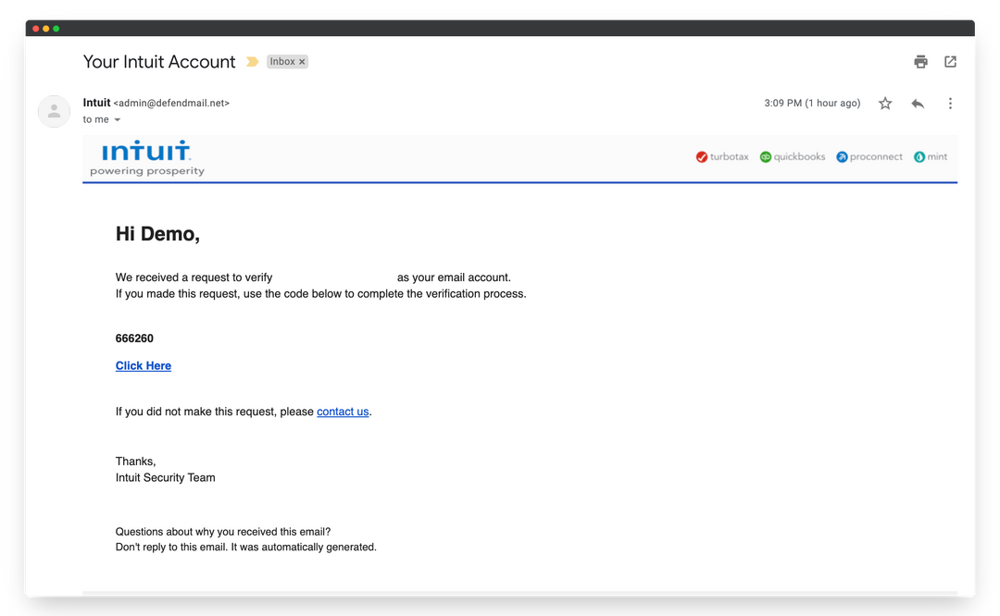
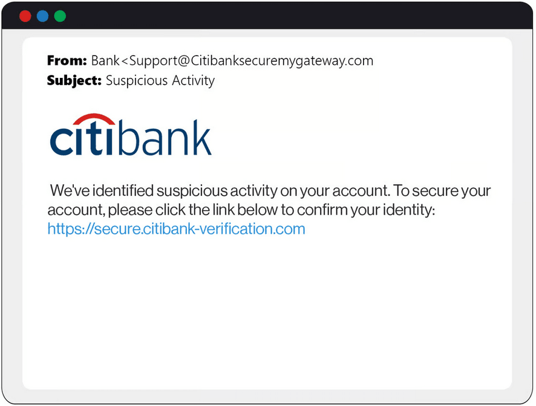
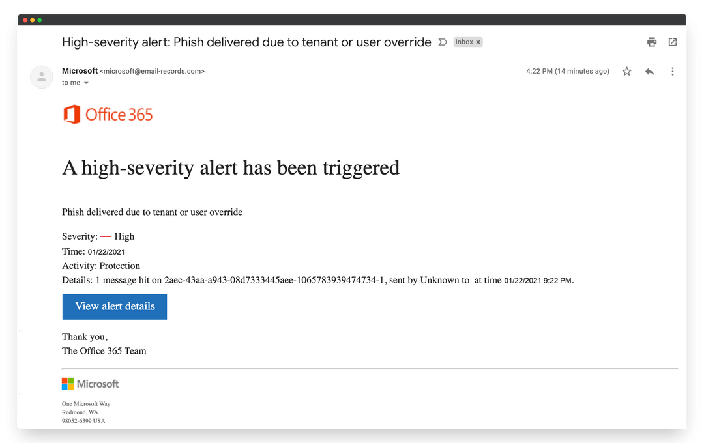
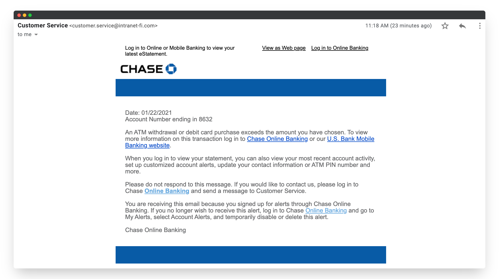
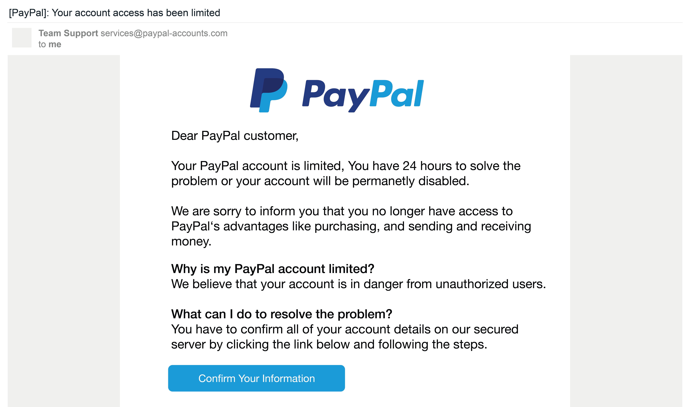

# Phishing Email Analyses

This file contains the step-by-step analysis of 7 phishing email samples. Each section includes a description, screenshot reference, and bullet-point findings based on the mini-guide. Images are embedded from `/resources/`. Screenshots were captured from online sample phishing emails for educational analysis and awareness.

## Analysis 1: FedEx Missed Delivery Phishing Email

**Sample Description** (from screenshot): Email from "fedex-updates@emails-track.com" notifying "Demo" of a missed delivery on 12/15/2020 for tracking number 748999912772025144. Includes "Manage Delivery" button and threat of return to sender if no response. Signature required.

**Analysis**:
- Sender spoofing: Domain "emails-track.com" mimics FedEx but is unrelated; legitimate FedEx uses @fedex.com.
- Header discrepancies: Research on similar scams shows fake "Received" lines from non-U.S. IPs (e.g., Eastern Europe relays) and SPF neutral/fail for fedex.com. No DKIM signature; high spam scores (e.g., 8/10).
- Suspicious links: "Manage Delivery" button likely links to phishing site (e.g., fakefedex-login.com).
- Urgent or threatening language: "If we do not receive a response the package will be returned to sender" creates fear of loss.
- Mismatched URLs: Button hovers to non-FedEx domain (inferred from examples like track-fake.com).
- Phishing traits summary: Classic delivery scam using greed/fear; leads to fake login for credential theft.

## Analysis 2: Microsoft Account Password Change Phishing Email

**Sample Description** (from screenshot): From "support@msupdate.net" notifying password change for "ethan@hookersecurity.co" on iOS/Safari from IP 77.196.86.10. Advises reset if unauthorized; includes steps to secure account.

**Analysis**:
- Sender spoofing: "msupdate.net" spoofs Microsoft; legit uses account-security@microsoft.com or similar.
- Header discrepancies: Similar phish show missing DMARC; "Received" from suspicious IPs (e.g., Russia/China); X-MS-Exchange-Organization-AuthAs absent.
- Suspicious links: Implied links in "Reset your password" steps lead to fake login pages.
- Urgent or threatening language: "Your account has been compromised" instills panic.
- Mismatched URLs: Steps link to non-microsoft.com domains (e.g., ms-security-fake.com).
- Phishing traits summary: Account takeover scam; exploits fear of unauthorized access to phish credentials.

## Analysis 3: Intuit Account Verification Phishing Email

**Sample Description** (from screenshot): From "admin@defendmail.net" for Intuit/TurboTax, providing code 666260 and "Click Here" for verification. Warns to contact if not requested.

**Analysis**:
- Sender spoofing: "defendmail.net" fakes Intuit; real uses @intuit.com or @turbotax.intuit.com.
- Header discrepancies: Examples show forged "Received" from U.S. proxies but SPF fail; no DKIM for intuit.com.
- Suspicious links: "Click Here" to malicious site (e.g., intuit-verify-phish.com); code is bait.
- Urgent or threatening language: Implies account lockout if not verified.
- Mismatched URLs: Link hovers to non-Intuit domain.
- Phishing traits summary: MFA bypass scam; steals login via fake verification.

## Analysis 4: Citibank Suspicious Activity Phishing Email

**Sample Description** (from screenshot): From "support@citi-bank-securitymygateway.com" alerting suspicious activity; link https://secure-citibank-verification.com to confirm identity.

**Analysis**:
- Sender spoofing: "citi-bank-securitymygateway.com" spoofs Citibank; legit is @citibank.com.
- Header discrepancies: Phish headers show domain mismatch in Return-Path; SPF/DKIM fail; IPs from high-risk countries.
- Suspicious links: Direct link to fake verification site.
- Urgent or threatening language: "Suspicious activity on your account" prompts immediate click.
- Mismatched URLs: URL is clearly fake (secure-citibank-verification.com vs. citibank.com).
- Phishing traits summary: Banking phish for credentials; uses fear of fraud.

## Analysis 5: Office 365 High-Severity Phishing Alert Email

**Sample Description** (from screenshot): From "microsoft@email-records.com" alerting high-severity phish delivered due to override on 01/22/2021; details message ID.

**Analysis**:
- Sender spoofing: "email-records.com" impersonates Microsoft; real alerts from security@microsoft.com.
- Header discrepancies: Mimics legit X-MS-Exchange headers but lacks CrossTenant auth; high-confidence phish tags absent.
- Suspicious links: "View alert details" button to fake dashboard.
- Urgent or threatening language: "High-severity alert" exploits irony (alert about phish is itself phish).
- Mismatched URLs: Button links to non-microsoft.com.
- Phishing traits summary: Meta-phish mimicking security alerts; steals admin creds.

## Analysis 6: Chase Bank ATM Withdrawal Phishing Email

**Sample Description** (from screenshot): From "customer.service@intrnet-fi.com" alerting ATM withdrawal exceeding balance on 01/22/2021, account ending 8632; urges log in to view.

**Analysis**:
- Sender spoofing: "intrnet-fi.com" spoofs Chase; legit is @chase.com.
- Header discrepancies: Typos in domain suggest poor spoof; SPF fail; relays from non-U.S. IPs.
- Suspicious links: "Log in to Online Banking" and "View as Web page" to fake sites.
- Urgent or threatening language: "Exceeds the amount you have chosen" implies fraud.
- Mismatched URLs: Links to non-chase.com.
- Phishing traits summary: Transaction alert scam; phishes banking login.

## Analysis 7: PayPal Account Limited Phishing Email

**Sample Description** (from screenshot): From "Team Support services@paypal-accounts.com" warning account limited for 24 hours; "Confirm Your Information" button to resolve.

**Analysis**:
- Sender spoofing: "paypal-accounts.com" fakes PayPal; legit uses @paypal.com.
- Header discrepancies: Some advanced phish pass DKIM via compromised servers, but Return-Path mismatches; suspicious IPs.
- Suspicious links: Button to fake confirmation page.
- Urgent or threatening language: "Account will be permanently disabled" in 24 hours.
- Mismatched URLs: Button hovers to non-paypal.com (e.g., paypal-confirm-phish.com).
- Phishing traits summary: Limitation scam; exploits fear of account loss for credential theft.

## Outcome
Through this hands-on analysis of diverse phishing samples—from delivery notifications to account alerts—I've gained a deeper understanding of how attackers blend technical tricks like domain spoofing and header forgery with psychological ploys like urgency and fear to bypass defenses. This exercise sharpened my skills in dissecting email threats, emphasizing proactive verification over reactive clicks, and reinforced that spotting even one red flag (e.g., a mismatched URL) can prevent credential theft or financial loss. Overall, it builds practical email threat analysis expertise, turning suspicion into informed action.
