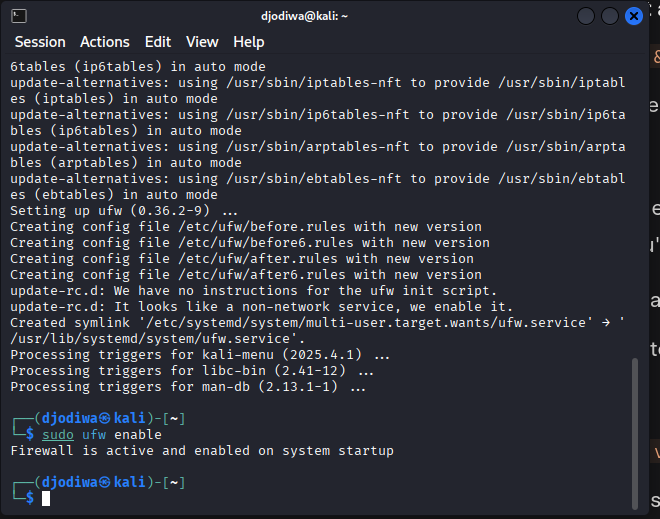
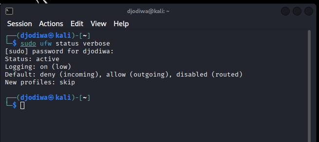
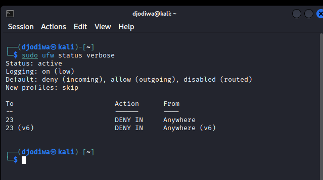
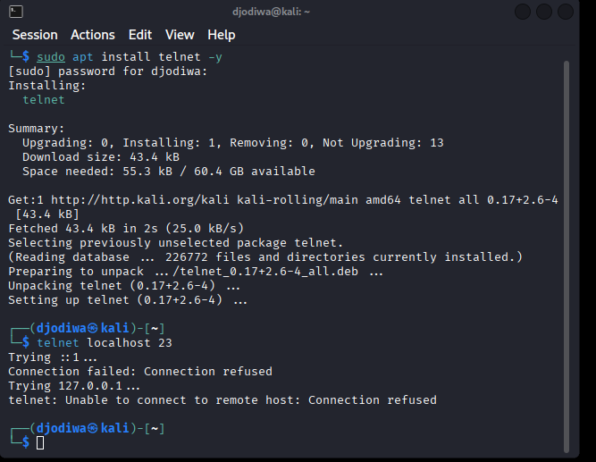
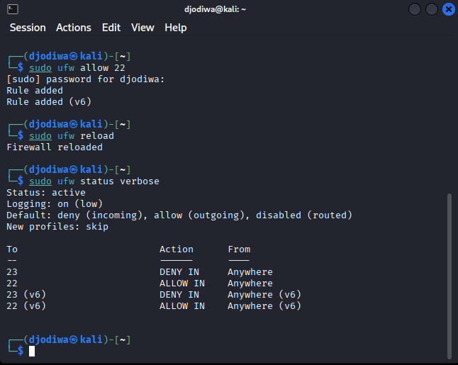
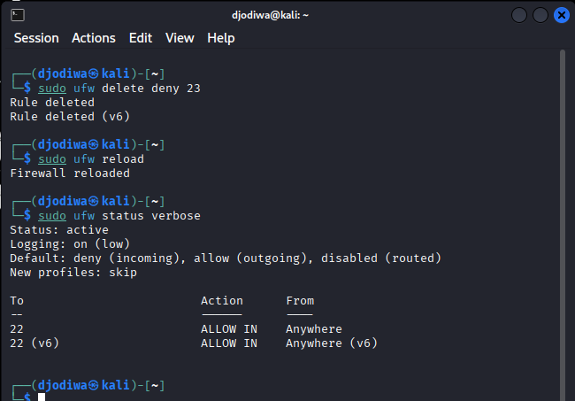

# Cyber Security Internship - Task4: Setup and Use a Firewall on Linux

## Introduction
Firewalls are essential security tools in computing that act as a barrier between a trusted internal network and untrusted external networks, such as the internet. They monitor and control incoming and outgoing network traffic based on predetermined security rules. This task demonstrates basic firewall management using UFW (Uncomplicated Firewall) on Linux, a user-friendly interface for managing iptables. By configuring rules to block or allow specific ports, we can enhance system security, prevent unauthorized access, and test these configurations in a controlled manner. The process involves setting up UFW, adding and testing rules for ports like Telnet (23) and SSH (22), and restoring the original state, all while documenting steps for reproducibility.

## Objective
Configure and test basic firewall rules using UFW on Linux to allow or block traffic.
 
## Steps and Commands

1. **Install and Enable UFW**:  
   - Updates the package list to ensure the latest software versions, installs UFW (Uncomplicated Firewall), and enables it to start filtering network traffic.  
   - **Command**: `sudo apt update && sudo apt install ufw -y`  
     `sudo ufw enable`  
   - 

2. **List Current Rules**:  
   - Displays the current firewall rules with detailed information, allowing you to verify the active configuration and ensure rules are set correctly.  
   - **Command**: `sudo ufw status verbose`  
   - 

3. **Add Block Rule for Port 23 (Telnet)**:  
   - Blocks incoming traffic on port 23 (used by Telnet) to prevent unauthorized access, then reloads UFW to apply the new rule immediately.  
   - **Command**: `sudo ufw deny 23`  
     `sudo ufw reload`  
   - 

4. **Test the Rule**:  
   - Tests the block rule by attempting to connect to port 23 locally; a failure confirms the rule is working, securing the system against Telnet access.  
   - **Command**: `telnet localhost 23`  
   - 

5. **Add Allow Rule for SSH (Port 22)**:  
   - Permits incoming traffic on port 22 (used by SSH) to allow secure remote access, then reloads UFW to apply the rule.  
   - **Command**: `sudo ufw allow 22`  
     `sudo ufw reload`  
   - 

6. **Remove Test Block Rule**:  
   - Deletes the block rule for port 23 to restore Telnet access (if needed), then reloads UFW to update the firewall configuration.  
   - **Command**: `sudo ufw delete deny 23`  
     `sudo ufw reload`  
   - 

## Conclusion
Through this task, I learned how to set up and manage a firewall on Linux using UFW, a powerful yet simple tool for controlling network traffic. By installing and enabling UFW, I understood how to initialize a firewall to secure a system. Listing rules with `ufw status verbose` taught me how to verify configurations, ensuring rules are correctly applied. Blocking Telnet (port 23) and testing the rule highlighted the importance of restricting vulnerable ports to prevent unauthorized access, while allowing SSH (port 22) emphasized enabling secure services. Removing the test rule demonstrated how to revert changes safely. This process underscored the role of firewalls in enforcing security policies by filtering traffic based on ports and protocols, providing hands-on experience in enhancing system security.
