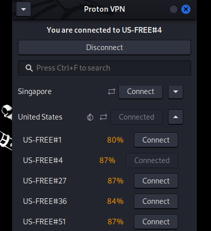
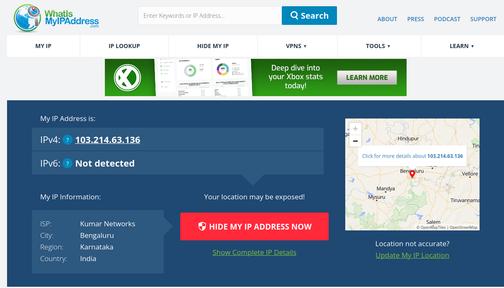
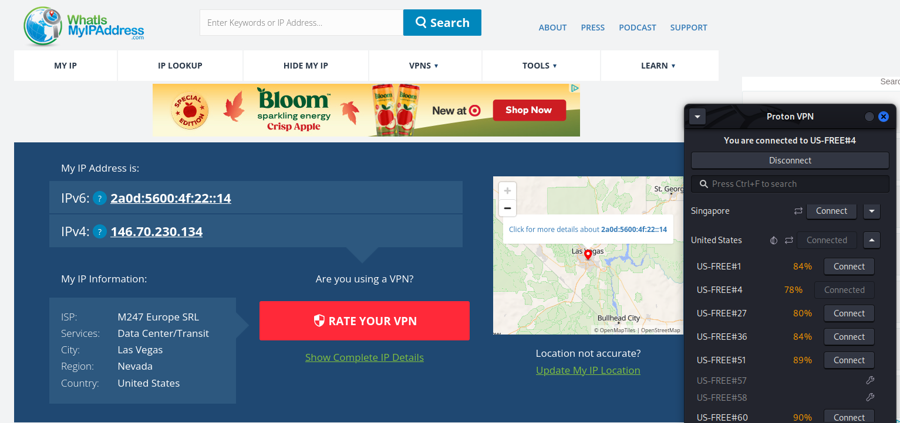
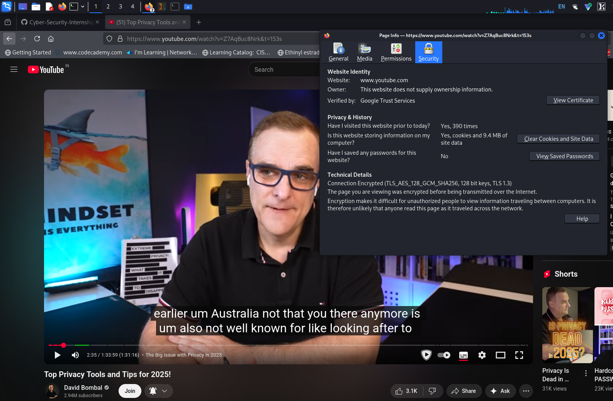
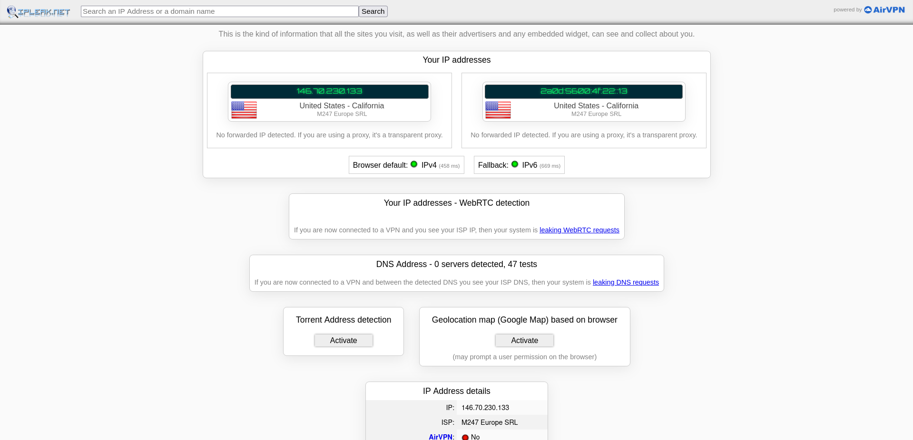
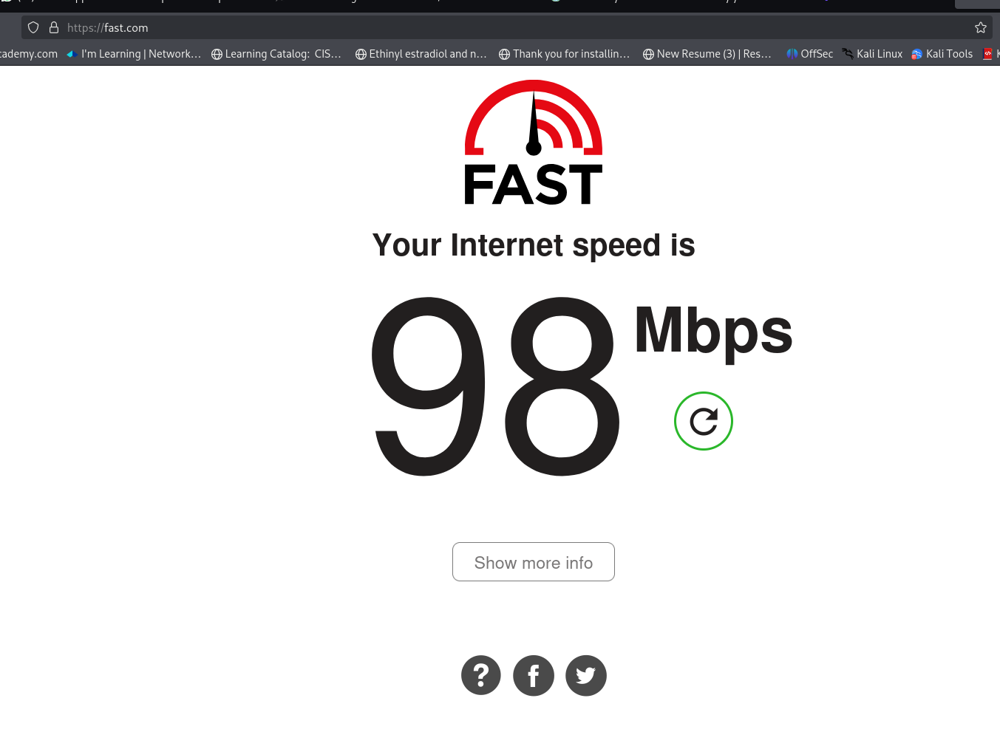
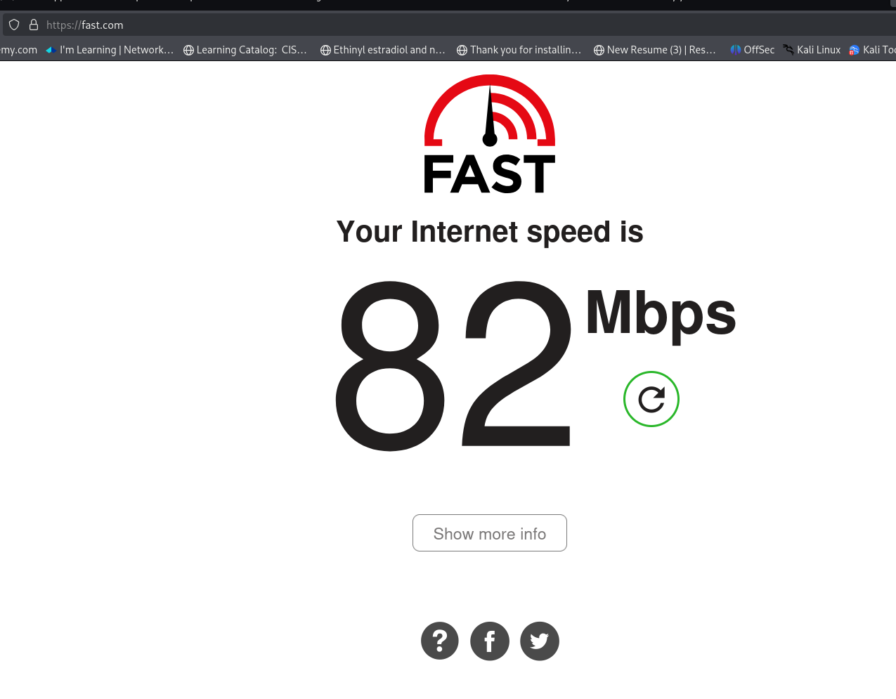

# Cyber Security Internship - Task 8: Working with VPNs

## Objective
The main goal of this task is to learn how VPNs (Virtual Private Networks) help protect our privacy and keep our online talks safe. A VPN acts like a secret tunnel for your internet traffic, hiding what you're doing from snoopers like hackers or even your internet service provider (ISP). I'll document my hands-on experience step by step using simple words, as if I'm explaining it to a friend who's new to this.

## Tools Used
I picked ProtonVPN's free tier because it's reputable, has no ads, doesn't log your activity, and is based in Switzerland (a country with strong privacy laws). It's available for Windows and easy to set up. (The guide also suggested Windscribe, but I stuck with ProtonVPN for this.)

## Step-by-Step Setup and Experience

### 1. Choosing a Reputable Free VPN Service and Signing Up
I selected ProtonVPN for its strong privacy focus and no-logs policy.

- Visited **protonvpn.com/free-vpn** and clicked **"Get Proton VPN Free"**.
- Entered a recovery email and created a secure password (12+ characters with mix of types).
- Account activated instantly no payment details required.

Free tier provides unlimited data but limits server access to three locations.

### 2. Downloading and Installing the VPN Client
You can download based on your system options for Windows, macOS, Linux, etc. Here I'm gonna be downloading Debian version as I am using Kali Linux.

- Opened a terminal and downloaded the repository package: `wget https://repo.protonvpn.com/debian/dists/stable/main/binary-all/protonvpn-stable-release_1.0.8_all.deb`.
- Installed the repository and updated packages: `sudo dpkg -i ./protonvpn-stable-release_1.0.8_all.deb && sudo apt update`.
- Installed the app: `sudo apt install proton-vpn-gnome-desktop`.
- Launched the app from the applications menu.

Took about 5 minutes total no issues on Kali Linux.

### 3. Connecting to a VPN Server
With the app open, I was ready to connect.

- Entered username (email) and password; logged in.
- Selected **US-Free#4** from the limited free options.
- Clicked **Quick Connect**; connected in ~10 seconds.

### 4. Verifying Your IP Address Has Changed
To prove it's working, I checked my IP (like your online "home address").

- **Before connecting:** I went to **whatismyipaddress.com**. It showed my real IP: 103.214.63.136, located in Bengaluru, Karnataka, India, with ISP Kumar Networks.
  

- **After connecting:** Refreshed the site. Now it showed a different IP: 146.70.230.134 (IPv4) and 2a0d:5600:4f:22:14 (IPv6), from Las Vegas, Nevada, United States, with ISP M247 Europe SRL (Data Center/Transit). It also detected "Proton VPN" and noted connection to US-FREE#4.

This confirms the VPN is hiding my real location great for privacy!

### 5. Browsing a Website to Confirm Traffic Is Encrypted

VPN active, I streamed a short video on YouTube about privacy basics. Load times were smooth, and the app's status bar confirmed full encryption no visible slowdowns or warnings.

A quick check on **ipleak.net** showed zero leaks in DNS or WebRTC, proving my data stayed tucked away in the tunnel.

### 6. Disconnecting VPN and Comparing Browsing Speed and IP
Time to see the difference.

- In the app, I clicked **Disconnect**. It took 5 seconds to switch off.
- Checked IP again on whatismyipaddress.com: Back to my original 103.214.63.136, location Bengaluru, India.
- Speed test: Used **fast.com**.
  
  - **VPN off (before): 98 Mbps download speed.**
    

    
  - **VPN on (after): 82 Mbps download speed.**
    

    
- Browsing: Pages loaded quicker without VPN, but the privacy trade-off is worth it for risky spots like coffee shop WiFi.

### 7. Researching VPN Encryption and Privacy Features
I dug into what makes ProtonVPN (and VPNs in general) tick for security.

- **Encryption Protocols:** ProtonVPN uses strong ones like:
  - **WireGuard** (default for free): Super fast, uses ChaCha20 encryption (like AES but lighter).
  - **OpenVPN**: Rock-solid with AES-256 (military-grade scrambling—think 256-bit key, unbreakable by brute force).
  - **Stealth**: Hides that you're using a VPN to beat blocks in strict countries.
  - They also use 4096-bit RSA for key exchange and SHA384 for checking data isn't tampered with. Plus, "Perfect Forward Secrecy" means if one session is cracked, others stay safe.

- **Privacy Features:**
  - **No-Logs Policy:** They don't track or store your activity (audited by third parties).
  - **Kill Switch:** If VPN drops, it blocks internet to prevent leaks.
  - **Secure Core:** Routes through privacy-friendly countries (paid feature, but basics are free).
  - Based in Switzerland no data-sharing laws like in the US or EU.
  - Free tier: Unlimited time/data, but only 3 countries' servers and 1 device at a time.

From my research, this setup protects against eavesdroppers but isn't foolproof (more on limits below).

### 8. Summary on VPN Benefits and Limitations
Here's a quick wrap-up in a table for easy reading:

| Aspect       | Benefits                                                                 | Limitations                                                              |
|--------------|--------------------------------------------------------------------------|--------------------------------------------------------------------------|
| **Privacy** | Hides your IP (e.g., from 103.214.63.136 in India to 146.70.230.134 in US) and real location from websites/ISPs. Encrypts all traffic so hackers on public WiFi can't steal data like passwords. | Doesn't make you fully anonymous VPN provider sees your traffic (but Proton doesn't log). Can't hide from your device (e.g., cookies). |
| **Security**| Secures remote work or streaming by creating an encrypted tunnel. Bypasses geo-blocks for global content. | Can slow speeds (e.g., from 98 Mbps to 82 Mbps here). Free tiers have fewer servers, leading to crowds and lag. Doesn't block malware/viruses—pair with antivirus. |
| **Overall** | Cheap/free way to boost safety on untrusted networks. Saves money on region locked deals (e.g., cheaper flights). | Relies on provider's trust. Not great for torrenting if speeds tank. Some sites block VPNs. |

In short: VPNs are like a privacy shield awesome for everyday protection, but not a magic invisibility cloak. Use them wisely!

## Outcome
This hands-on task gave me real feel for VPNs. I now get why they're key in cyber security: They turn leaky public internet into a safe pipe. Setting up took 10 minutes, and testing showed clear changes in IP (from Indian to US-based) and speed (slight drop but still fast). Next time I'm on airport WiFi, I'll flip it on without thinking. Learned tons about encryption too excited for more tasks!
